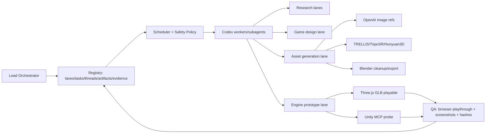

# Current Best Practices Matrix: Managed Agents Game Generation Chain

Date: 2026-05-12

Scope: production-grade managed agents control plane plus an AI-assisted game development chain that upgrades the captured `14.html` prototype into a better 3D game demo with stronger gameplay, engine structure, assets, textures/materials, validation, and release evidence.

Decision labels:

- Adopt: use as a primary lane now.
- Probe: run a bounded, evidence-producing experiment before promoting.
- Defer: keep on radar; not on the critical path yet.
- Reject: do not use for this chain unless facts change.

## Executive Decision Matrix

| Area | Candidate | Decision | Why | Next evidence gate | Sources |
| --- | --- | --- | --- | --- | --- |
| Managed agents control plane | OpenAI Codex App Server + local registry/scheduler | Adopt | Codex App Server is the right control surface for thread/turn orchestration; production quality still requires our own registry, idempotency, worker result schema, safety policy, and artifact index. | Implement `lanes.yaml`, SQLite registry, read-only CLI, `WORKER_RESULT` schema, and no-duplicate dispatch test. | [OpenAI App Server engineering post](https://openai.com/index/unlocking-the-codex-harness/), [Codex product page](https://openai.com/codex), [App Server README](https://github.com/openai/codex/blob/main/codex-rs/app-server/README.md) |
| Managed agents parallelism | Codex subagents | Adopt | Best fit for bounded repo-local exploration, review, test mapping, and implementation slices while the lead thread owns planning and integration. Use explicit task contracts. | Spawn 3 read-only workers and 1 write worker against small lanes; require structured return with evidence paths. | [Codex subagents docs](https://developers.openai.com/codex/subagents), [OpenAI Codex page](https://openai.com/codex) |
| Managed agents isolation | Codex worktrees | Adopt | Necessary for production-grade parallel edits and reviewable diffs. Use lead-owned merge discipline; never let worker threads write across unrelated lanes. | Create one disposable implementation worktree; verify changed files, tests, and artifact indexing. | [Codex worktrees docs](https://developers.openai.com/codex/app/worktrees), [OpenAI Codex page](https://openai.com/codex) |
| Managed agents automation | Codex automations / heartbeat jobs | Probe | Useful for scheduled research refresh and stale-task nudges, but should not replace the scheduler. Treat automation as a trigger source only. | One paused or low-risk heartbeat that refreshes source status into a report; no autonomous destructive actions. | [OpenAI Codex page](https://openai.com/codex) |
| Unity official path | Unity AI / official MCP Server via `com.unity.ai.assistant` | Probe | Strategic long-term path because it is Unity-backed, but current access requires Unity Editor 6.3+, Unity Cloud link, AI terms, package install, credits/subscription, and org enablement. Recent issue tracker entries show MCP connection risk in 2.7 pre-release. | Disposable Unity 6.3+ project: install package, enable MCP tools, approve client, create/read scene, read console, capture screenshot/log. Pin version and record failures. | [Unity AI open beta user guide](https://support.unity.com/hc/en-us/articles/48060149523476-Getting-started-with-Unity-AI-open-beta-user-guide), [Unity issue UUM-141533](https://issuetracker.unity3d.com/issues/mcp-tools-return-connection-revoked-when-used-by-an-ai-client), [Unity issue UUM-141165](https://issuetracker.unity3d.com/issues/mcp-connection-fails-when-a-windows-account-with-cloudap-authentication-is-used), [Unity custom MCP tools discussion](https://discussions.unity.com/t/tutorial-how-to-create-custom-mcp-tools-for-unity/1717182) |
| Unity community path | CoplayDev `unity-mcp` / MCP for Unity | Probe | Best community candidate to test first: active repo, broad tool list, Unity 2021.3 LTS+ support, HTTP/stdio options, scene/assets/scripts/materials/tests/console tools. Local HTTP must be bound to localhost and treated as privileged editor control. | Install into disposable Unity project; run `manage_scene`, `manage_gameobject`, `manage_material`, `read_console`, `run_tests`; save logs and generated scene. | [CoplayDev/unity-mcp](https://github.com/CoplayDev/unity-mcp), [Coplay releases](https://github.com/CoplayDev/unity-mcp/releases), [Context7 Coplay docs mirror](https://context7.com/coplaydev/unity-mcp) |
| Unity community path | IvanMurzak `Unity-MCP` | Probe | Mature alternative with .NET server pattern; useful if CoplayDev is unstable or if its architecture fits HomePC/Windows better. Needs provider-key and server-surface review before adoption. | Install server in disposable project; compare scene mutation, script generation, test/log support, safety prompts, and failure recovery. | [IvanMurzak installation wiki](https://github.com/IvanMurzak/Unity-MCP/wiki/Installation-Guide), [Augment MCP registry entry](https://www.augmentcode.com/mcp/unity-mcp) |
| Unity community path | TSavo `Unity-MCP` | Defer | Relevant bridge candidate, but current matrix already has two stronger first probes. Use only if CoplayDev/IvanMurzak fail specific requirements. | Lightweight read-only install notes only; no large downloads. | [TSavo/Unity-MCP](https://github.com/TSavo/Unity-MCP) |
| Unity community path | Advanced Unity MCP / UnityCodeMCPServer-style smaller projects | Defer | Potentially useful for specialized code/project-context features, but not first-line production chain until main Unity editor-control path is proven. | Track capability deltas; only probe after primary Unity MCP baseline. | [Signal-Loop UnityCodeMCPServer mention](https://www.reddit.com/r/LLMDevs/comments/1rjoocc/built_an_mcp_server_for_unity_editor_connect_your/), [advanced-unity-mcp mentions](https://www.reddit.com/r/GameDevelopment/comments/1l9l6cq/free_advanced_unity_mcp_by_code_maestro/) |
| Blender automation | `ahujasid/blender-mcp` | Probe | Strong candidate for AI-assisted asset cleanup, scene inspection, material assignment, GLB export, screenshots, Poly Haven/Sketchfab references, and Python automation. It executes arbitrary Blender Python, so it must run in a disposable project with local-only access. | Install Blender + addon, run create-object/material/camera/screenshot/export-GLB cycle; verify exported GLB with Three.js parser. | [ahujasid/blender-mcp](https://github.com/ahujasid/blender-mcp), [Blender Python API](https://docs.blender.org/api/current/index.html), [Blender GLTF export operator](https://docs.blender.org/api/current/bpy.ops.export_scene.html) |
| Blender automation | Unofficial Blender MCP websites/marketplaces | Reject | Use only as secondary discovery. The GitHub repo itself warns that unofficial websites are not affiliated; production decisions should not trust mirrored instructions over the source repo. | None unless a specific project is source-verified. | [ahujasid/blender-mcp](https://github.com/ahujasid/blender-mcp) |
| Browser/game runtime | Three.js + GLTFLoader / GLB-first workflow | Adopt | Fastest path from current HTML prototype to upgraded web demo. glTF/GLB is the natural interchange format; GLTFLoader is official and already aligns with existing browser validation. | Build P1 playable slice with local module build or pinned dependency, GLB asset manifest, screenshot/pixel checks, input replay, and completion proof. | [Three.js GLTFLoader docs](https://threejs.org/docs/pages/GLTFLoader.html), [Three.js loading 3D models manual](https://threejs.org/manual/en/loading-3d-models.html), [Three.js load glTF manual](https://threejs.org/manual/en/load-gltf.html) |
| Browser/game runtime | Raw single-file CDN HTML as production base | Reject | Good as inspiration and baseline, but not production-grade: hard to test, hard to version assets, hard to validate, and fragile under AI edits. | Preserve original; extract modules and behavior specs instead of editing it directly. | [Three.js loading 3D models manual](https://threejs.org/manual/en/loading-3d-models.html) |
| Concept art / textures / UI | OpenAI GPT Image / `gpt-image-1.5` | Adopt | Current OpenAI docs identify `gpt-image-1.5` as the latest advanced image-generation model; use it for concept sheets, orthographic asset references, style consistency, texture/UI/icon candidates, and iterative edits. | Generate one art bible sheet and 3 orthographic reference images; record prompts, model, output hashes, and downstream 3D conversion results. | [OpenAI image generation guide](https://platform.openai.com/docs/guides/image-generation), [GPT Image 1.5 model docs](https://platform.openai.com/docs/models/gpt-image-1.5), [OpenAI image generation blog](https://openai.com/index/new-chatgpt-images-is-here/) |
| 3D generation | Microsoft TRELLIS / TRELLIS-image-large | Adopt for mesh-only baseline; probe for textured production assets | Already fits image-to-3D experiments and official repo recommends text-to-image first, then image-to-3D. Use as reproducible local/GPU pipeline, but require Blender/Three.js/Unity validation before calling assets production-ready. | Convert 3 reference images to GLB; record mesh stats, watertightness, bbox, material/texture presence, render preview, and engine import. | [microsoft/TRELLIS](https://github.com/microsoft/TRELLIS), [NVIDIA TRELLIS model card](https://build.nvidia.com/microsoft/trellis/modelcard) |
| 3D generation | Microsoft TRELLIS.2 | Probe | Very relevant newer candidate for higher-fidelity PBR assets, but likely large model/download/runtime cost. Do not download large files until size, license, and no-proxy plan are reviewed. | Read-only repo/model-size assessment; only download if each file is under policy or user approves. Compare output quality against current TRELLIS. | [microsoft/TRELLIS.2](https://github.com/microsoft/TRELLIS.2) |
| 3D generation | TripoSR | Adopt as speed/CPU-friendly fallback | Useful for fast single-image reconstruction and broad compatibility; source/weights are open and it can run under lower budgets. Treat as geometry bootstrap, not final textured game asset. | Convert the same references as TRELLIS; compare speed, topology, scale, GLB import, and collider suitability. | [Stability AI TripoSR announcement](https://stability.ai/news/triposr-3d-generation), [VAST-AI-Research/TripoSR](https://github.com/VAST-AI-Research/TripoSR), [TripoSR paper](https://arxiv.org/abs/2403.02151) |
| 3D generation + texture | Tencent Hunyuan3D 2.1 | Probe | Strong candidate for high-fidelity mesh plus PBR material pipeline. More moving parts and dependencies than TripoSR; good as texture/material comparison lane after baseline validators are stable. | Generate textured GLB with embedded PBR maps; verify material channels in Blender and Three.js, then Unity import. | [Tencent-Hunyuan/Hunyuan3D-2.1](https://github.com/Tencent-Hunyuan/Hunyuan3D-2.1), [Hunyuan3D 2.1 paper](https://arxiv.org/abs/2506.15442) |
| 3D generation + texture | Hunyuan3D 2.5 / Omni-style newer papers | Defer | Promising, but not first operational target unless there is a stable official repo/weights path that fits download and hardware constraints. Keep as research refresh item. | Monthly research refresh; promote only with source-verified repo, license, model size, and reproducible run path. | [Hunyuan3D 2.5 paper](https://arxiv.org/abs/2506.16504), [Hunyuan3D-Omni paper](https://arxiv.org/abs/2509.21245) |
| End-to-end game agents | OpenGame | Probe | Valuable reference architecture for web-game generation because it combines game-specific skill memory, templates, debugging, asset providers, and headless/VLM evaluation. Do not replace our control plane; mine its patterns. | Read docs/code only first; extract template skill, debug skill, benchmark/evaluation ideas into our lanes. No large model downloads. | [leigest519/OpenGame](https://github.com/leigest519/OpenGame), [OpenGame paper](https://arxiv.org/abs/2604.18394), [Creative Bloq OpenGame overview](https://www.creativebloq.com/3d/video-game-design/this-experimental-open-source-ai-turns-prompts-into-playable-marvel-star-wars-and-harry-potter-games) |
| End-to-end game agents | One-shot prompt-to-game as the main workflow | Reject | Good demos are inspiring, but production-grade game generation needs persistent requirements, asset provenance, playtest feedback, deterministic tests, and human review gates. | Use one-shot generation only for ideation or benchmark comparison. | [OpenGame paper](https://arxiv.org/abs/2604.18394) |

## Recommended Chain Architecture

Best current sequence:

1. Adopt the managed agents substrate first: `lanes.yaml`, SQLite registry, `WORKER_RESULT`, scheduler policy, artifact/evidence index.
2. Adopt Three.js/GLB as the first playable runtime because it directly extends the existing HTML baseline and is easiest to validate locally.
3. Adopt OpenAI image generation for concept/reference/style sheets.
4. Adopt TRELLIS and TripoSR as first 3D asset generators, with TRELLIS as quality candidate and TripoSR as speed/fallback.
5. Probe Blender MCP for cleanup/material/export/screenshots.
6. Probe Unity official MCP and CoplayDev Unity MCP in disposable projects; do not block the web demo on Unity.
7. Probe OpenGame for reusable game-specific skill architecture and benchmark ideas, not as a replacement for this repo's managed controller.

## Production Acceptance Criteria

Managed agents acceptance:

- Every lane has an explicit `enabled/paused/disabled` state.
- Every task has `task_id`, owner lane, goal, done criteria, current state, thread/worktree references, artifacts, evidence, and next action.
- Every worker returns schema-valid `WORKER_RESULT`.
- Scheduler enforces idempotency, cooldown, retry limits, per-lane concurrency, and no dispatch into disabled lanes.
- Human-gated operations include publish, deploy, push/merge, large downloads, paid API/credit spend, and privileged editor/project mutations.
- App Server / MCP / editor bridges are local-only by default and never exposed as unauthenticated network services.

Game chain acceptance:

- The original `14.html` remains a preserved baseline.
- P1 demo is modular, testable, and has a repeatable run command.
- At least one upgraded playable scene uses authored/imported GLB assets rather than only primitives.
- Each generated asset has provenance: source prompt/image/model/tool/version/hash, preview, mesh stats, material/texture report, and engine import result.
- The playable demo has browser smoke tests, input replay or equivalent interaction proof, screenshots, and release packet.
- Unity is considered promoted only after an editor/MCP loop can create/read/mutate a scene, inspect logs, run a test or play mode gate, and export evidence.

## Candidate-Specific Notes

### Unity

Official Unity AI/MCP is strategically important but not yet safe to depend on as the first critical path. The current official access path requires Unity 6.3+, Unity Cloud linkage, AI terms, `com.unity.ai.assistant`, credits, and organization enablement. Recent Unity issue tracker reports around 2.7 pre-release show MCP client connection revocation/regression risk. Therefore, official Unity is a probe lane until local evidence exists.

CoplayDev `unity-mcp` is the strongest community first probe because it exposes concrete Unity editor operations across scenes, assets, scripts, materials, graphics, physics, UI, console, tests, and docs. Because it can mutate a Unity project through a local server, it must run only in a disposable project and under a worker protocol that records every command.

### Blender

Blender MCP is useful after image-to-3D generation because generated meshes often need scale normalization, decimation/remesh decisions, collider proxy creation, material cleanup, UV/texture inspection, and render previews. Treat Blender Python execution as privileged. The first probe should only touch a disposable `.blend` and exported GLB.

### Three.js / GLB

Three.js remains the fastest path to a better version of the existing HTML game. The production baseline should move away from one monolithic file and toward modules, pinned dependencies, asset manifests, and tests. GLB should be the interchange default because it can carry geometry, materials, textures, and animations in one binary package.

### Image And 3D Generation

OpenAI image generation should produce the art bible and stable reference images first. For 3D, run the same input references through TRELLIS, TripoSR, and Hunyuan3D candidates to compare:

- mesh quality and scale,
- watertightness/collider suitability,
- material and texture channels,
- GLB export/readback,
- Three.js import,
- Blender inspection,
- Unity import when Unity lane is ready.

Do not describe generated meshes as production assets until they pass engine import plus visual and gameplay validation.

### OpenGame

OpenGame is currently best treated as a research and pattern source. Its important ideas are game-specific template memory, debug-skill memory, asset provider integration, and benchmark/evaluation loops. Those map well onto this repo's managed agents design, but the repo should keep its own registry/scheduler/evidence model.

## First Work Batch

| Task ID | Lane | Decision | Output | Done Criteria |
| --- | --- | --- | --- | --- |
| BP-001 | controller-core | Adopt | `lanes.yaml` draft, SQLite schema, read-only status CLI, worker result schema | Can list lanes/tasks/artifacts; disabled lane never dispatches; invalid worker result fails closed. |
| BP-002 | game-design | Adopt | P1 child-friendly game design doc derived from `14.html` excitement loops | Replaces combat theme with explore/collect/avoid/solve loop while preserving responsive feedback. |
| BP-003 | threejs-runtime | Adopt | Modular Three.js P1 playable slice | Runs locally; loads at least one GLB; browser screenshot and input proof captured. |
| BP-004 | image-assets | Adopt | OpenAI image reference/style sheet packet | Prompts, outputs, hashes, and downstream 3D conversion candidates recorded. |
| BP-005 | asset-3d | Adopt/Probe | TRELLIS + TripoSR comparison report | Same reference image processed by both; GLB readback and preview evidence captured. |
| BP-006 | blender-mcp | Probe | Blender MCP minimal cycle | Create/material/export/screenshot succeeds in disposable project; GLB passes Three.js parse. |
| BP-007 | unity-mcp | Probe | Unity official/Coplay comparison packet | Disposable project evidence: scene create/read/mutate, console, test/play mode or documented blocker. |
| BP-008 | opengame | Probe | OpenGame pattern extraction note | Template skill, debug skill, benchmark ideas mapped to local lanes; no large model download. |

## Download And Network Boundary

- No large downloads for this matrix task.
- For future source/model acquisition, use no-proxy command-local policy and verify download processes do not use local Clash ports.
- Any single file over 1 GB requires explicit user approval before download.
- MCP/editor servers are privileged control surfaces. Bind to localhost, avoid public WebSocket/HTTP exposure, and record configuration.

